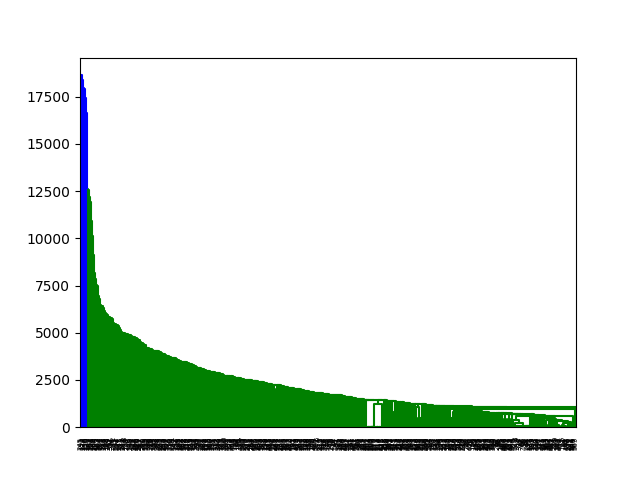
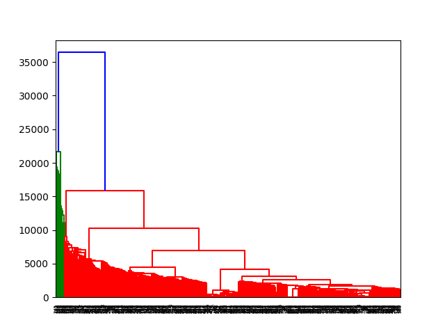
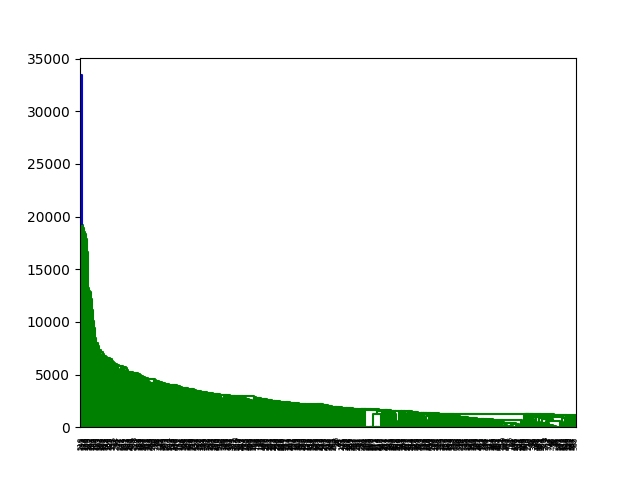

# Agglomerative-Clustering
Agglomerative Clustering done in three different methods. The methods being Single Link, Complete Link and Average Link on the DNASequences.fasta dataset to build a Phylogenetic Tree.
The following are the results that I've obtained after the clustering process.

## Single Link

## Complete Link

## Average Link

